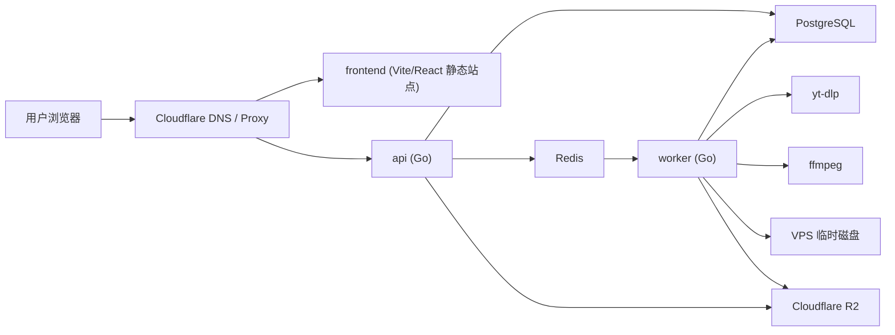

# YT Video Downloader 技术设计

## 1. 目标

本文定义一个基于 `yt-dlp` 的视频下载网站最小可行方案，采用以下固定技术路线：

- `monorepo`
- 后端：`Go`
- 前端：`Vite + React`
- 部署：`Docker Compose`
- 运行环境：`VPS`
- 域名入口：自定义域名
- 数据库：`PostgreSQL`
- 队列/缓存：`Redis`
- 对象存储：`Cloudflare R2`

设计目标：

- 支持用户提交单个 YouTube 视频链接并创建下载任务。
- 下载、转码、上传全部异步执行。
- 兼顾可维护性、可扩展性和部署简单度。
- 优先支持自用、内部工具或仅处理用户有权下载的内容。
- 当前产品口径为“登录后每账号 3 次免费下载”。

## 2. 总体结论

这套方案比“全放 Cloudflare 运行时”更适合当前项目，原因如下：

- `yt-dlp` 和 `ffmpeg` 更适合运行在标准 Linux 容器里。
- Go 适合做 API、任务调度和 Worker。
- Vite + React 足够轻，前后端分离清晰。
- Cloudflare 继续承担 DNS、TLS、WAF、CDN 和反向代理。
- 最终文件放 `R2`，避免 VPS 本地磁盘无限膨胀。

## 3. 业务范围

### 3.1 支持

- 提交单个 YouTube 视频 URL
- 探测视频元信息
- 创建下载任务
- 下载固定产品规格：`MP4 360p / 480p / 720p / 1080p + audio-mp3`
- 查询任务状态
- 下载已完成文件
- 文件过期后自动清理

### 3.2 暂不支持

- 播放列表下载
- 频道批量抓取
- 会员内容或登录态内容
- 多站点下载
- 匿名下载
- 免费用户无限制使用已取消，当前产品改为登录后每账号 3 次免费

## 4. 高层架构



流量入口：

- `your-domain.example -> Cloudflare -> VPS`

服务组成：

- `frontend`：静态资源服务
- `api`：鉴权、任务创建、状态查询、下载地址签发
- `worker`：真正执行下载、转码、上传
- `postgres`：业务数据和任务元数据
- `redis`：任务队列、速率限制、短期缓存

## 5. Monorepo 结构

建议目录：

```text
/
  apps/
    web/                 # Vite + React
    api/                 # Go API
    worker/              # Go Worker
  packages/
    shared-types/        # 前后端共享 DTO/字段定义
    config/              # 公共配置模板
  deploy/
    docker/
      Dockerfile.api
      Dockerfile.worker
      Dockerfile.web
    nginx/               # 可选，若需要静态资源或反代
    compose/
      docker-compose.yml
  docs/
    TECHNICAL_DESIGN.md
```

原则：

- `api` 和 `worker` 分开，避免下载任务拖垮 API。
- 共享内容放 `packages/`，不要让前后端互相引用应用代码。

## 6. 技术选型

### 6.1 前端

- `Vite + React + TypeScript`

职责：

- 登录
- URL 输入
- 视频元信息预览
- 创建下载任务
- 展示任务状态
- 下载结果页

选择理由：

- 构建快，部署简单。
- 适合做一个以表单、状态页为主的控制台式产品。
- 生成静态资源后可由 `nginx` 或 Go 静态服务直接托管。

### 6.2 API

- `Go`
- 推荐框架：`chi` 或 `gin`

职责：

- 用户鉴权
- URL 校验
- 调用 `yt-dlp` 做视频探测
- 创建任务
- 查询任务状态
- 生成 R2 下载链接
- 后台管理接口

建议：

- API 只做轻操作，不执行长时间下载和转码。
- 所有重任务均通过 Redis 队列交给 Worker。

### 6.3 Worker

- `Go`
- 内部通过子进程调用：
  - `yt-dlp`
  - `ffmpeg`

职责：

- 消费下载任务
- 创建独立工作目录
- 下载视频
- 转码或封装
- 上传到 R2
- 更新数据库状态
- 清理临时文件

### 6.4 数据库

- `PostgreSQL 17`

用于存储：

- 用户
- 下载任务
- 视频元数据缓存
- 文件记录
- 审计日志
- 配额和限流统计

为什么用 Postgres：

- 关系型结构清晰，适合任务系统。
- 事务、索引、JSON 字段能力成熟。
- Go 生态稳定，迁移和运维成本低。

### 6.5 队列与缓存

- `Redis`

用于：

- 下载任务队列
- 任务重试
- 限流计数
- 短期缓存

建议：

- 队列逻辑先用简单可靠的实现，不急着一开始做复杂调度。

### 6.6 文件存储

存储分两层：

1. 临时工作目录：VPS 本地磁盘
2. 最终文件存储：`Cloudflare R2`

R2 用于：

- 最终下载文件
- 缩略图
- 可选归档日志

为什么直接上 R2：

- 与 Cloudflare 入口天然贴合。
- 适合做下载文件分发。
- 不把大文件长期压在 VPS 上。
- 后续多机扩容时，不需要迁移本地文件。

### 6.7 反向代理与入口

- 站点主域名：`https://your-domain.example`
- `www.your-domain.example` 可选做别名
- VPS 上使用 `Caddy` 作为本机入口反代
- Cloudflare 托管 DNS，并在源站证书签发后切为 `Full (strict)`

当前固定路由：

- `/` -> `frontend`
- `/api/*` -> `api`

## 7. 核心模块

### 7.1 URL 校验模块

只允许：

- `https://www.youtube.com/watch?v=...`
- `https://youtu.be/...`

后续如需支持 `shorts`，单独增加规则。

校验内容：

- 域名白名单
- 参数规范化
- 提取视频 ID
- 拒绝非 HTTP(S)
- 拒绝内网地址和本地路径

### 7.2 Metadata Probe 模块

职责：

- 调用 `yt-dlp --dump-single-json --no-playlist`
- 返回标题、时长、封面和可选格式

作用：

- 用户先预览再确认下载
- 提前做时长和文件大小限制

### 7.3 Download Engine 抽象层

Go 接口建议：

```go
type DownloadEngine interface {
    Probe(ctx context.Context, url string) (*VideoMeta, error)
    Download(ctx context.Context, job DownloadJob) (*DownloadArtifact, error)
}
```

默认实现：

- `YtDlpEngine`

好处：

- 业务层不直接耦合命令行细节
- 未来更换实现或扩多站点更容易

### 7.4 Worker 执行模块

每个任务目录示例：

```text
/data/jobs/{jobId}/
  input/
  output/
  logs/
  meta.json
```

执行流程：

1. 从 Redis 取任务
2. 在本地创建工作目录
3. 用 `yt-dlp` 下载
4. 如需 `mp4`，调用 `ffmpeg`
5. 上传最终文件到 R2
6. 更新 Postgres 状态
7. 删除本地临时目录

### 7.5 File Delivery 模块

两种方案：

- API 代理下载
- R2 预签名链接

推荐：

- 默认使用 R2 预签名链接

理由：

- API 不承担大文件带宽
- 降低 VPS 压力
- 链接可设置短期有效期

### 7.6 进度通知模块

MVP 建议：

- 先做轮询

后续升级：

- WebSocket
- 或 SSE

说明：

- 由于 Cloudflare 代理层存在超时限制，整个下载流程不要设计成单个长 HTTP 请求。
- 正确方式是创建异步任务，然后查询状态。

## 8. API 设计

### 8.1 探测视频

`POST /api/videos/probe`

请求：

```json
{
  "url": "https://www.youtube.com/watch?v=fiVdZ3ZkIjw"
}
```

响应：

```json
{
  "videoId": "fiVdZ3ZkIjw",
  "title": "What Makes White Tea So Different?",
  "durationSec": 197,
  "thumbnailUrl": "https://...",
  "profiles": [
    {"id": "video-720p", "kind": "video", "container": "mp4", "available": true},
    {"id": "audio-mp3", "kind": "audio", "container": "mp3", "available": true}
  ]
}
```

### 8.2 创建任务

`POST /api/downloads`

请求：

```json
{
  "url": "https://www.youtube.com/watch?v=fiVdZ3ZkIjw",
  "profileId": "video-720p"
}
```

响应：

```json
{
  "jobId": "job_123",
  "status": "queued"
}
```

### 8.3 查询任务

`GET /api/downloads/:jobId`

响应：

```json
{
  "jobId": "job_123",
  "status": "processing",
  "progress": 67,
  "step": "transcoding"
}
```

### 8.4 获取结果

`GET /api/downloads/:jobId/result`

响应：

```json
{
  "jobId": "job_123",
  "status": "completed",
  "fileName": "video.mp4",
  "fileSize": 47402991,
  "downloadUrl": "https://..."
}
```

## 9. 数据模型

### 9.1 users

- `id`
- `email`
- `password_hash`
- `role`
- `created_at`
- `updated_at`

### 9.2 downloads

- `id`
- `user_id`
- `source_url`
- `source_video_id`
- `source_site`
- `title`
- `status`
- `output_format`
- `progress`
- `step`
- `error_code`
- `error_message`
- `duration_sec`
- `file_name`
- `file_ext`
- `file_size`
- `r2_object_key`
- `thumbnail_url`
- `created_at`
- `updated_at`
- `expires_at`

状态机：

- `queued`
- `probing`
- `downloading`
- `transcoding`
- `uploading`
- `completed`
- `failed`
- `expired`

### 9.3 video_meta_cache

- `source_video_id`
- `title`
- `duration_sec`
- `thumbnail_url`
- `raw_meta_json`
- `fetched_at`

### 9.4 audit_logs

- `id`
- `user_id`
- `action`
- `target_id`
- `ip`
- `user_agent`
- `created_at`

## 10. 任务执行细节

### 10.1 探测命令

```bash
yt-dlp --dump-single-json --no-playlist "<url>"
```

### 10.2 下载命令

```bash
yt-dlp --no-playlist -o "<workdir>/output/%(title)s [%(id)s].%(ext)s" "<url>"
```

### 10.3 转码为兼容 MP4

```bash
ffmpeg -y -i input.webm -c:v libx264 -c:a aac -movflags +faststart output.mp4
```

说明：

- 若输入流本身兼容 `mp4`，可优先尝试无损封装。
- 若不兼容，则转码为 `H.264 + AAC`。

### 10.4 R2 上传流程

1. Worker 在本地生成最终文件
2. 以 `downloads/{yyyy}/{mm}/{jobId}/filename.ext` 作为对象键上传到 R2
3. 将 `r2_object_key`、`file_size`、`expires_at` 写入 Postgres
4. API 查询时返回短期有效下载链接

对象键建议：

```text
downloads/2026/03/job_123/video.mp4
```

## 11. 部署设计

### 11.1 Docker Compose 服务

建议服务：

- `web`
- `api`
- `worker`
- `postgres`
- `redis`
- `caddy` 或 `nginx`

### 11.2 容器职责

- `web`：构建和提供 Vite 静态资源
- `api`：Go HTTP 服务
- `worker`：Go 后台任务进程
- `postgres`：主数据库
- `redis`：队列与缓存
- `caddy/nginx`：本机反向代理与 TLS 回源

### 11.3 挂载卷

建议卷：

- `postgres_data`
- `redis_data`
- `job_data`

说明：

- `job_data` 用于任务临时目录
- 最终文件不长期保存在卷里，而是上传到 R2

## 12. 安全设计

### 12.1 Cloudflare 层

- 域名在切换为代理前，先用 `DNS only` 完成源站证书签发
- `SSL/TLS` 使用 `Full (strict)`
- 使用 `Origin CA`
- 建议开启 `Authenticated Origin Pulls`

目的：

- 防止他人绕过 Cloudflare 直接访问源站
- 降低源站暴露风险

### 12.2 源站层

- VPS 只暴露 `80/443`
- 内部服务仅使用 Docker 内网通信
- API、Worker、Postgres、Redis 不直接暴露公网

### 12.3 输入与命令安全

- 严格校验 URL
- 不拼接不可信 shell 字符串
- 通过受控参数调用 `yt-dlp`
- 限制文件名和目录名

### 12.4 资源控制

- 单用户并发任务数限制
- 单任务时长限制
- 单任务文件大小限制
- Worker 总并发限制
- R2 对象自动过期

## 13. 可观测性

日志：

- API 访问日志
- 下载任务日志
- `yt-dlp` stderr/stdout
- `ffmpeg` 关键日志

指标：

- 创建任务数
- 成功率
- 平均下载耗时
- 平均转码耗时
- 队列积压长度
- R2 上传耗时
- 失败原因分布

告警：

- 队列长时间堆积
- 连续下载失败
- R2 上传失败
- 磁盘空间不足

## 14. 合规边界

- 默认只处理用户有权下载的内容
- 站点应要求用户确认拥有下载权限
- 不支持受保护内容或绕过访问限制
- 若未来公开运营，需要补充版权投诉、内容下架和风控流程

结论：

- 作为自用或内部工具，这套方案技术上合理
- 作为公开下载站，技术可行，但合规与运营风险仍然高

## 15. MVP 范围

第一阶段只做：

- 登录用户提交单个 YouTube URL
- 视频元信息预览
- 创建下载任务
- 输出固定规格 `MP4 360p / 480p / 720p / 1080p + audio-mp3`
- 任务状态轮询
- 成功后返回 R2 下载链接
- 文件 24 小时自动过期

暂不做：

- 播放列表
- 批量任务
- 匿名下载
- 支付
- 多站点

## 16. 推荐结论

最终技术方案：

- Monorepo
- 前端：`Vite + React`
- 后端：`Go API + Go Worker`
- 队列/缓存：`Redis`
- 数据库：`PostgreSQL`
- 对象存储：`Cloudflare R2`
- 部署：`Docker Compose`
- 运行环境：`VPS`
- 域名入口：自定义域名

这是一个很稳的组合：

- 开发和部署成本可控
- 二进制下载链路运行自然
- 后续扩容空间足够
- 文件存储和业务数据职责清晰
